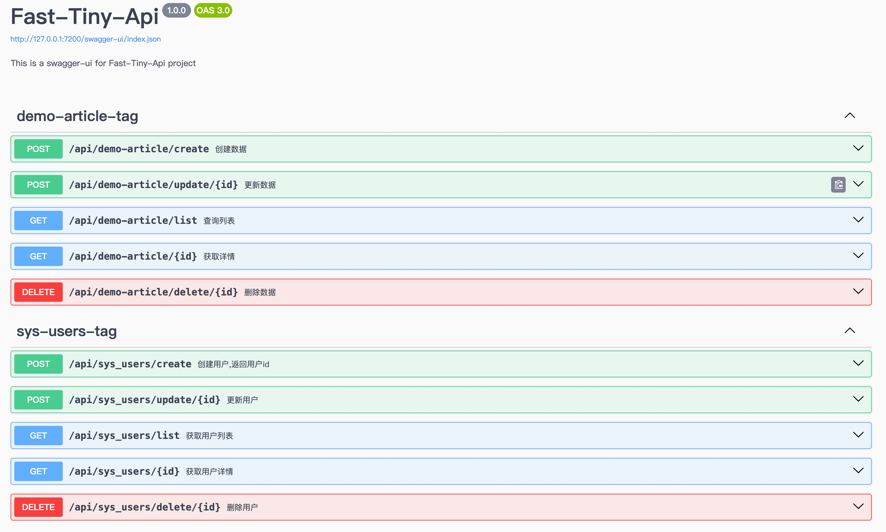
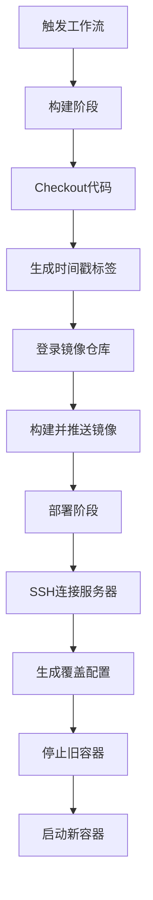

# fast-tiny-midway

## 简介
- 一个基于 MidwayJS 的轻量级全栈快速开发模板，聚焦于快速搭建中小型 Node.js 服务端应用。
- 内置统一响应体、参数检验、错误处理等常用功能，开箱即用。
- 项目通过规范目录结构，TypeScript + ESLint，确保代码质量，提高可维护性。
- 项目通过 Docker 容器化部署，确保环境一致性，降低部署成本。

## 项目展示


## 技术选型
|   名称   |           说明            |
| :------: | :-----------------------: |
| 核心框架 | MidwayJS 3.0 + TypeScript |
|   ORM    | TypeORM（默认使用MySQL）  |
| API 文档 |        Swagger UI         |
| 代码质量 |      ESLint + Husky       |
| 代码生成 |     Plop + Handlebars     |
| 项目部署 |  Docker + Github-Actions  |

## 本地开发

### 环境准备
|      名称      |                      安装方式                      |    验证命令     |    版本    |
| :------------: | :------------------------------------------------: | :-------------: | :--------: |
|    Node.js     |        [官方地址](https://nodejs.org/zh-cn)        |    `node -v`    | `>=22.0.0` |
|      pnpm      |            [官方地址](https://pnpm.io/)            |    `pnpm -v`    | `>=10.0.0` |
|     MySQL      | [官方地址](https://dev.mysql.com/downloads/mysql/) |        -        | `>=8.0.0`  |
| Docker（可选） |        [官方地址](https://www.docker.com/)         |   `docker -v`   | `>=26.0.0` |
|  PM2（可选）   |                `npm install -g pm2`                | `pm2 --version` |     -      |

**数据库初始化需要执行[导入脚本](./docs/fast_tiny_db.sql)，创建用户表和示例表，并且插入示例数据。**

**注意： 本地开发和生产环境部署需要修改数据库配置，文件位于[默认配置](./src/config/config.default.ts)、[生产配置](./src/config/config.prod.ts)。**

### 快速启动
```bash
# 1. 克隆项目
git clone --depth 1 https://github.com/liangjiayu/fast-tiny-midway.git
cd fast-tiny-midway

# 2. 安装依赖
pnpm install

# 3. 启动开发服务
pnpm run dev

# 4. 访问接口文档
open http://localhost:7200/swagger-ui
```

### 模块开发示例
```bash
# 使用 plop命令 一键生成模块CRUD代码
pnpm plop

? 请输入模块名称(英文名称,如 product-info ): product
⠋ 请注意默认生成的实体类，默认字段有id、created_at、updated_at、deleted_at，请确认 product 表是否包含这些字段，否则请手动修改实体类！
✔  ++ /src/modules/product/product.controller.ts
✔  ++ /src/modules/product/product.entity.ts
✔  ++ /src/modules/product/product.service.ts
```

#### 模板代码说明
自动生成模块代码，并且可在swagger文档上查看接口。
```bash
src/modules/product/
├── product.controller.ts    # 控制器层（路由入口）
├── product.entity.ts       # 数据库实体类
└── product.service.ts      # 服务层（业务逻辑）
```

控制器代码如下：
```typescript
@ApiTags('product-tag')
@Controller('/api/product')
export class ProductController {
  @Inject()
  ctx: Context;

  @Inject()
  baseService: ProductService;

  @Post('/create')
  @ApiOperation({ summary: '创建数据' })
  @ApiOkResponse({
    type: wrapResponse({ type: Number }),
  })
  async create() {
    const result = await this.baseService.create();
    return result;
  }

  @Get('/list')
  @ApiOperation({ summary: '查询列表' })
  @ApiOkResponse({
    type: wrapResponse({ type: ProductEntity, struct: 'Page' }),
  })
  async list() {
    const records = await this.baseService.list();
    return records;
  }

  @Post('/update/:id')
  @ApiOperation({ summary: '更新数据' })
  @ApiOkResponse({
    type: wrapResponse({ type: Boolean }),
  })
  async update(@Param('id') id: number) {
    const result = await this.baseService.update(id);
    return result;
  }

  @Del('/delete/:id')
  @ApiOperation({ summary: '删除数据' })
  @ApiOkResponse({
    type: wrapResponse({ type: Boolean }),
  })
  async delete(@Param('id') id: number) {
    const result = await this.baseService.delete(id);
    return result;
  }

  @Get('/:id')
  @ApiOperation({ summary: '获取详情' })
  @ApiOkResponse({
    type: wrapResponse({ type: ProductEntity }),
  })
  async details(@Param('id') id: number) {
    const result = await this.baseService.details(id);
    return result;
  }
}
```

## 项目结构

### 根目录文件（重点文件）
|        名称         |            说明             |
| :-----------------: | :-------------------------: |
|        .env         |      环境变量配置文件       |
|     Dockerfile      |    Docker 容器化构建文件    |
| docker-compose.yml  |    Docker 多容器编排配置    |
| ecosystem.config.js |   PM2 进程管理器配置文件    |
|   plop-templates/   |       代码生成器模板        |
|  eslint.config.mjs  |     ESLint 代码规范配置     |
|    bootstrap.js     |      应用启动入口文件       |
| .github/workflows/  | GitHub Actions 持续集成配置 |

### 核心代码目录
```bash
├── src/
│   ├── common/
│   │   ├── dto/               # 公共数据传输对象
│   │   ├── response/          # 统一响应格式
│   │   └── utils/             # 工具函数
│   ├── config/
│   │   ├── config.default.ts  # 所有环境基础配置
│   │   ├── config.local.ts    # 本地开发配置
│   │   ├── config.prod.ts     # 生产环境配置
│   │   └── config.daily.ts    # 日常环境配置
│   ├── constants/             # 全局常量
│   ├── controller/            # 全局控制器
│   ├── filter/                # 异常过滤器
│   ├── middleware/            # 中间件
│   └── modules/
│       └── module/      # 文章模块
│           ├── [module].controller.ts  # 模块控制器层
│           ├── [module].entity.ts      # 模块数据库实体层
│           └── [module].service.ts     # 模块业务逻辑层
└── (其他根目录文件)
```

### 常用开发命令
|     命令     |                 说明                 |
| :----------: | :----------------------------------: |
|     plop     |     启动代码生成器，快速创建模块     |
|     dev      |   启动本地开发服务器，监听文件变化   | 、 |
|    build     |   编译TypeScript，打包生产环境文件   |
|     lint     |       执行 ESLint 代码规范检查       |
|   lint:fix   |     自动修复 ESLint 可修复的错误     |
|    start     |     直接以生产模式启动 Node 服务     |
| start:server | 使用 PM2-Runtime启动服务（容器专用） |
|  pm2:start   |          通过 PM2 启动服务           |
|   pm2:stop   |       停止 PM2 服务并清理日志        |
| docker:build |   根据 docker-compose.yml 构建镜像   |
|  docker:up   |           启动所有容器服务           |
| docker:down  |          停止并移除所有容器          |

## 一键部署
根据项目情况，选择适合的部署方式，以下是基于 GitHub Actions 的持续集成部署。



#### GitHub Secrets 配置
在仓库的 `Settings -> Secrets -> Actions` 中添加以下密钥：

| Secret 名称        | 作用说明                                            |
| :----------------- | --------------------------------------------------- |
| SERVER_HOST        | 部署服务器的公网 IP                                 |
| SSH_USERNAME       | 登录服务器的 SSH 用户名，默认为 root                |
| SSH_PRIVATE_KEY    | 用于 SSH 登录服务器的私钥内容（需与服务器公钥配对） |
| DOCKERHUB_USERNAME | Docker Hub 账号用户名                               |
| DOCKERHUB_TOKEN    | Docker Hub 的访问令牌                               |

#### 服务器环境
- 确保服务器已安装 Docker 和 Docker Compose。
- 在服务器上创建项目目录（例如 `/home/admin/fast-tiny-midway`），并上传 `docker-compose.yml`、`.env`和`.env.override`文件，具体可参考项目。

#### 服务器环境隔离
- 每一台机器有独立的`.env`配置，通过`MIDWAY_SERVER_ENV`变量做隔离，如：`MIDWAY_SERVER_ENV=daily`，`MIDWAY_SERVER_ENV=prod`。
- 其中`daily`对应配置文件在`/config/config.daily.ts`，`prod`对应配置文件在`/config/config.prod.ts`。
